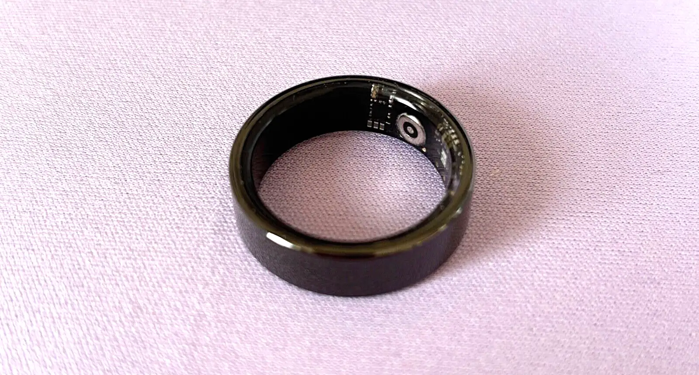

# RingCLI 0.1.5

CLI access to data stored on the Colmi R02 smart ring.



You can [buy one from Colmi](https://www.colmi.info/products/colmi-r02-smart-ring). They are very cheap.

For more information, see [this blog post](https://blog.smittytone.net/2025/04/09/hoard-of-the-rings-colmi/).

## Important Note on Firmware Variants

I have had three Colmi R02 rings. All have run slightly different firmware. A silver one bought a month or so back is at 3.00.17; a black one bought recently is on 3.00.33. Yet the companion mobile app tells me both are running the latest firmware! Despite the minor firmware version difference (they are only patches apart, if the version number is anything to go by), the first offers a full BLE Device Info service (for example) whereas the latter lacks some of the information values that service provides. It also offers an unknown service that the (slightly) older ring does not.

The older ring’s BLE Device Info firmware version is `R02_3.00.17_240903`; the newer one’s is `RY02_3.00.33_250117`. Their hardware revisions are `R02_V3.0` and  `RY02_V3.0`, respectively. Apart from the colour, one ring is size 8, the other is size 9. Surely that can’t account for the slightly different hardware version? Maybe it does.

What does all this mean for this project? That it is pursuing a moving target, and that the ring you buy may not operate entirely as expected. If you run into issues, in particular BLE errors, please let me know through the [issues system](https://github.com/smittytone/RingCLI/issues).

## Release Notes

* 0.1.5 adds auto-binding on scan, and binding can now take an optional display name. This will be the BLE local name
* 0.1.4 adds [real-time pulse readings](#real-time-heart-rate).
* 0.1.3 adds [sleep data retrieval](#daily-sleep-record).
* 0.1.2 updates [SpO2 retrieval](#daily-blood-oxygen) to list the current day’s values or, if you use the `--full` flag, all data available.

## Compilation

1. [Install Go](https://go.dev/dl/)
1. Clone this repo
1. `cd RingCLI`
1. `go mod tidy`
1. `go build -o build/ringcli`

## Thank You

These sites have been invaluable:

* [Colmi BLE API](https://colmi.puxtril.com)
* [colmi_r02_client](https://tahnok.github.io/colmi_r02_client/colmi_r02_client.html)

## Usage

### Utilities

#### Scan for Rings

You require your ring’s BLE address to issue most sub-commands (but see [Bind a Ring](#bind-a-ring)). Obtain it by scanning for rings:

```shell
ringcli utils scan --first
```

If your ring is in range and powered on (ie. it has been placed the the charger at least once), you should see it listed and you can copy its address.

**Note** The `--first` in the command above causes `ringcli` to halt scanning on the first ring it finds. If you have multiple rings, do not include the `--first` switch. `ringcli` will now list all of them — or, at least, those it can detect within its 60-second scan window.

Include the `--bind` flag to automatically retain the ring’s address and name for future use. See [**Bind a Ring**](#bind-a-ring), below, for more details.

**Note** If *ringlci* detects multiple rings, it will bind the first it finds. This may not be the one you would prefer to be bound. If this is the case, use the [`bind` sub-command](#bind-a-ring) to bind your preferred ring instead. **Hint** Make sure you also also include `bind`’s `--overwrite` flag to revise the existing binding.

#### Set Ring Time

If you haven’t used another app to set the date and time on your ring, run:

```shell
ringlci utils time --address {your ring BLE address}
```

You will need to do this to initialise your ring for use if you have not done so already.

**Note** If you perform this operation later, it will reset your ring and any data it has recorded about your activity.

#### Get Ring Info

With your ring’s address you can now obtain more information about it, including its battery state:

```shell
ringlci utils info --address {your ring BLE address}
```

#### Get Battery State

To just get the ring’s battery state, issue:

```shell
ringlci utils battery --address {your ring BLE address}
```

#### Get and Set Periodic Heart Rate Sampling

To enable periodic heart rate readings, issue:

```shell
ringlci utils heartrate --address {your ring BLE address} --period 60 --enable
```

The period is in minutes and must be in the range of 1 to 255. Setting the period to zero disables periodic readings, as does using the `--disable` switch (unless `--enable` has been included too).

```shell
ringlci utils heartrate --address {your ring BLE address} --disable
```

This call gets the current state:

```shell
ringlci utils heartrate --address {your ring BLE address} --show
```

#### Locate a Ring

To locate your ring, if you’re unsure where it is, issue:

```shell
ringlci utils find --address {your ring BLE address}
```

This will flash the ring’s green LED twice. If that’s not sufficient, add the `--continuous` switch:

```shell
ringlci utils find --address {your ring BLE address} --continuous
```

To flash the LED every two seconds until you cancel. The ring will cease flashing after 200 seconds to preserve ring battery power.

#### Bind a Ring

To save having to enter the `--address` option every time, you can ‘bind’ your ring to your system. This retains the ring’s BLE address across runs.

```shell
ringlci utils bind --address {your ring BLE address}
```

You can add the ring’s display name, if you wish, with the `--name` option:

```shell
ringlci utils bind --address {your ring BLE address} --name MySmartRing
```

The name you add is not used to identify the ring in BLE communications; it is included only for your convenience. If you select the auto-bind option when performing a [scan for rings](#scan-for-rings), the bound name will be set to the ring’s BLE local name.

To check a binding, run:

```shell
ringlci utils bind --show
```

You can only bind one ring: to check on other rings, pass in a temporary BLE address with the `--address` option.

#### Shutdown a Ring

To shut the ring down, issue:

```shell
ringlci utils shutdown --address {your ring BLE address}
```

This powers down the ring. The ring can be restarted by placing it on its charger.

### Data

#### Daily Steps, Calories Burned, Distance Moved

The above sub-commands are provided by the `utils` command. `ringcli` also has a `data` command:

```shell
ringlci data steps --address {your ring BLE address}
```

This will output your current daily step count, activity based calorie burn and the distance you have travelled (estimate).

#### Daily Heart Rate Log

The `data` sub-command `heartrate` will retrieve the day’s heart rate readings (from midnight to the current time):

```shell
ringlci data heartrate --address {your ring BLE address}
```

#### Real Time Heart Rate

Add the `--realtime` flag to the `data` sub-command `heartrate` to view your current heart rate in real time:

```shell
ringlci data heartrate --address {your ring BLE address} --realtime
```

It takes a few moments for the ring to begin streaming data, but then you will see your current pulse count. The code presents this for 30 seconds and then provides you with an average value over that time period.

#### Daily Blood Oxygen

The `data` sub-command `spo2` will retrieve the current day‘s blood oxygen (SpO2) values:

```shell
ringlci data spo2 --address {your ring BLE address}
```

Add the `--full` switch to get a list of all blood oxygen data available:

```shell
ringlci data spo2 --address {your ring BLE address} --full
```

#### Daily Sleep Records

The `data` sub-command `sleep` will retrieve the most recent night’s sleep record:

```shell
ringlci data sleep --address {your ring BLE address}
```

Add the `--full` switch to get a list of all sleep records available:

```shell
ringlci data sleep --address {your ring BLE address} --full
```

## Copyright and Licence

`ringcli` is copyright © 2025, Tony Smith (@smittytone). The code is made available under the terms of the MIT licence.
